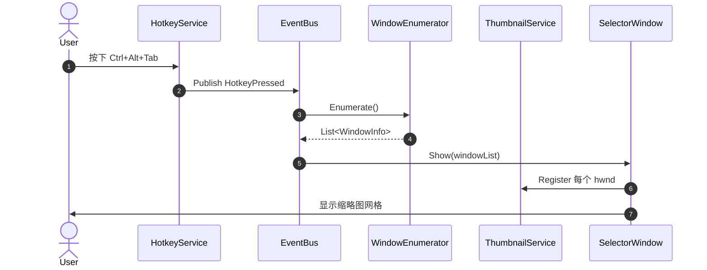
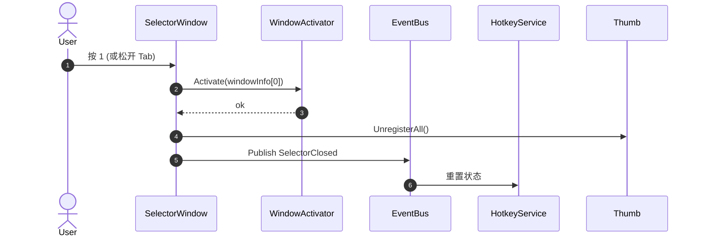
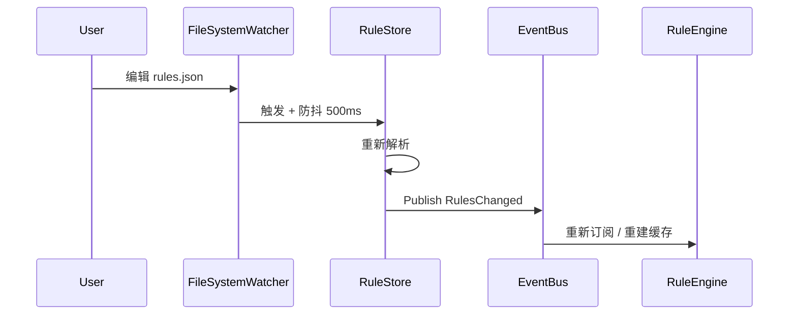

# Alt-Tab 替换器 — 详细设计文档

> 状态：**待评审**
> 版本：v0.1
> 适用阶段：P1 MVP + P2 自定义排序
> 技术栈：C# / .NET 8 / WPF

---

## 1. 目标与范围

### 1.1 一句话目标
替代 Windows 默认 `Alt+Tab` 切换器，提供可自定义的窗口预览 / 选择 / 切换能力，并支持用户自定义窗口排序与排除。

### 1.2 范围内（P1 + P2）
- 全局热键 `Ctrl+Alt+Tab` 唤起选择器
- 当前可见顶层窗口的缩略图网格
- 键盘 `123QWE` 物理位置索引 + 鼠标点击选择
- 窗口激活（最小化恢复 + 置顶 + 切前台）
- 自定义排序规则（置顶 / 排除 / 优先级 / 进程名或窗口标题匹配）
- 简单配置窗口（增删 / 拖拽改优先级 / 启停）
- JSON 持久化 + 热重载

### 1.3 范围外（明确不做）
- 多显示器适配（P3 再说）
- UWP / Store App（Cloaked 窗口）兼容
- 安装包、代码签名、开机自启、托盘
- 多语言、模糊搜索、分组、虚拟桌面

---

## 2. 架构总览

### 2.1 分层

```
┌────────────────────────────────────────────────────┐
│  UI 层 (WPF)                                        │
│  SelectorWindow / ConfigWindow / RuleEditor         │
└────────────────────────┬───────────────────────────┘
                         │ 事件订阅 / 视图模型绑定
┌────────────────────────┴───────────────────────────┐
│  服务层 (Core)                                      │
│  HotkeyService / WindowEnumerator / ThumbnailSvc /  │
│  WindowActivator / RuleEngine / RuleStore / EventBus│
└────────────────────────┬───────────────────────────┘
                         │ P/Invoke
┌────────────────────────┴───────────────────────────┐
│  Win32 互操作层 (user32 / dwmapi / shell32)         │
└────────────────────────────────────────────────────┘
```

### 2.2 进程模型
**单进程**。所有模块同进程内协作，通过 `EventBus` 解耦 UI 与服务。WPF 主线程负责 UI 渲染与消息循环（接收 `WM_HOTKEY`），Win32 调用通过 `Dispatcher.Invoke` 回到 UI 线程执行。

### 2.3 模块通信
- 同步调用：服务 → 服务
- 异步事件：服务 → UI（`IObservable<T>` + `Dispatcher` 投递）
- 状态查询：UI → 仓储（只读快照）

---

## 3. 关键类设计

> 类签名使用 C# 伪代码，仅表达契约，不写实现。

### 3.1 `WindowInfo`（值对象 / record）
```csharp
public sealed record WindowInfo(
    IntPtr Hwnd,
    string Title,
    string ProcessName,
    int ProcessId,
    bool IsMinimized,
    IntPtr IconHandle
);
```

### 3.2 `SortRule`（值对象 / record）
```csharp
public sealed record SortRule(
    Guid Id,
    MatchType MatchType,      // ProcessName | WindowTitle | Regex
    string Pattern,
    int Priority,             // 数值越大越靠前
    bool IsPinned,            // 置顶
    bool IsExcluded           // 排除
);

public enum MatchType { ProcessName, WindowTitle, Regex }
```

### 3.3 `HotkeyService`
```csharp
public interface IHotkeyService
{
    event Action HotkeyPressed;
    event Action HotkeyReleased;

    bool Register(ModifierKeys mods, Key key);  // false 表示已被占用
    void Unregister();
}
```
- 内部用 `HwndSource` 接收 `WM_HOTKEY`
- 注册 ID 固定为 `0xBEEF`，避免冲突
- 修饰键按下 / 释放通过 `GetAsyncKeyState` 轮询（30Hz）感知

### 3.4 `WindowEnumerator`
```csharp
public interface IWindowEnumerator
{
    IReadOnlyList<WindowInfo> Enumerate();  // 同步，按"用户期望顺序"输出
}
```
- 调用 `EnumWindows` 收集
- 应用过滤（详见 5.2）
- 调用 `RuleEngine.Apply` 重排
- **P1 阶段**：`RuleEngine` 是 no-op（按 z-order 倒序输出）

### 3.5 `ThumbnailService`
```csharp
public interface IThumbnailService
{
    IntPtr Register(IntPtr sourceHwnd, IntPtr destinationHwnd);
    void Update(IntPtr thumbnail, RECT dest, bool visible = true);
    void Unregister(IntPtr thumbnail);
}
```
- 包装 DWM API
- 缓存 HTHUMB → source HWND 映射，便于失效清理

### 3.6 `WindowActivator`
```csharp
public interface IWindowActivator
{
    void Activate(WindowInfo target);
}
```
- 实现见 5.4

### 3.7 `RuleEngine`
```csharp
public interface IRuleEngine
{
    IReadOnlyList<WindowInfo> Apply(IReadOnlyList<WindowInfo> raw);
}
```
- 流程：排除 → 置顶 → 按 Priority 降序 → 同优先级按 z-order 倒序
- `RuleStore` 变化时通过 `EventBus` 通知 `WindowEnumerator` 重建

### 3.8 `RuleStore`
```csharp
public interface IRuleStore
{
    IReadOnlyList<SortRule> Current { get; }
    void Add(SortRule rule);
    void Remove(Guid id);
    void Update(SortRule rule);

    event Action Changed;  // 防抖 500ms 后触发
}
```
- 内部：JSON 文件 + `FileSystemWatcher`（兼容外部编辑）

### 3.9 `EventBus`
```csharp
public interface IEventBus
{
    void Publish<T>(T evt);
    IDisposable Subscribe<T>(Action<T> handler);
}
```
- 极简实现：类型 → 委托字典
- UI 端订阅时通过扩展方法 `OnUIThread()` 自动 `Dispatcher.Invoke`

### 3.10 `SelectorWindow`（WPF 视图）
- `ItemsControl` 绑定 `IReadOnlyList<WindowInfo>`
- 模板：缩略图 + 标题 + 索引标签
- `PreviewKeyDown` 处理 123QWE
- `MouseMove` 改变 `SelectedIndex`
- `MouseLeftButtonUp` 确认

---

## 4. 数据流 / 时序

### 4.1 唤起选择器


### 4.2 切换窗口


### 4.3 进程死亡 / 窗口关闭
- `WindowEnumerator` 每次 `Enumerate` 重新走 `EnumWindows`，无显式订阅
- 选择器显示期间，UI 端轮询（1Hz）刷新 `IsWindow` 与可见性，关闭的窗口从网格移除

### 4.4 规则热重载


---

## 5. 关键技术细节

### 5.1 全局热键
- 使用 `RegisterHotKey(hwnd, id, MOD_CONTROL | MOD_ALT | MOD_NOREPEAT, VK_TAB)`
- 选择器可见期间，需要把 `Tab` 键从系统传递中"屏蔽"——通过在 `SelectorWindow.PreviewKeyDown` 中 `e.Handled = true` 即可（焦点已在选择器内）
- 修饰键释放（`Ctrl` / `Alt` 任一松开）→ 立即切到当前高亮并隐藏选择器

### 5.2 窗口枚举与过滤
**调用**：`EnumWindows(EnumWindowsProc, IntPtr.Zero)`

**过滤条件（全部满足才保留）**：
| # | 条件 | API |
|---|---|---|
| 1 | 可见 | `IsWindowVisible(hwnd) == true` |
| 2 | 非工具窗口 | `(GetWindowLong(hwnd, GWL_EXSTYLE) & WS_EX_TOOLWINDOW) == 0` |
| 3 | 非 Cloaked | `DwmGetWindowAttribute(DWMWA_CLOAKED) == 0`（UWP 后台） |
| 4 | 非自身 | `hwnd != process.MainWindowHandle && hwnd != thisHwnd` |
| 5 | 标题非空 | `GetWindowTextLength > 0` |
| 6 | 有 PID | `GetWindowThreadProcessId != 0` |
| 7 | 进程可访问 | `OpenProcess(QueryLimitedInformation) != 0`（排除系统保护进程） |

**排序（未应用规则时）**：按 z-order 倒序（最近激活的在前）。`EnumWindows` 本身是 z-order，逆序遍历即可。

**性能**：典型 10–30 个窗口，<5ms。

### 5.3 缩略图（DWM）
- `DwmRegisterThumbnail(thisHwnd, sourceHwnd)` → HTHUMB
- `DwmUpdateThumbnailProperties`：
  - `DWM_TNP_RECTDESTINATION`：256×144（或等比缩放）
  - `DWM_TNP_VISIBLE` = true
  - `DWM_TNP_OPACITY` = 255
  - `DWM_TNP_SOURCECLIENTAREAONLY` = false（含边框）
- 关闭 / 隐藏选择器时遍历 `DwmUnregisterThumbnail`
- **坑点**：必须在 WPF 窗口已经 `Show()` 之后才能注册缩略图（HTHUMB 绑到目标 HWND 句柄）

### 5.4 窗口激活
Windows 限制：只有前台进程能把窗口设为前台。

**P1 解决方案（足够稳）**：
1. `AllowSetForegroundWindow(targetPid)` —— 在切窗前调用
2. 若最小化：`ShowWindow(hwnd, SW_RESTORE)`
3. `BringWindowToTop(hwnd)`
4. `SetForegroundWindow(hwnd)`

**兜底**：若步骤 4 失败，模拟一次 `Alt` 按键（`keybd_event` 或 `SendInput`）解锁前台锁，再重试一次。

**重试**：最多 3 次，每次间隔 50ms。

### 5.5 键盘 123QWE 索引映射（与 Alt-Tab Terminator 一致）
按 QWERTY **物理位置** 排列，**不**按字母序：

| 行 | Virtual Key | 索引 |
|---|---|---|
| 数字 | `VK_1` … `VK_9` | 0–8 |
| Q 行 | `VK_Q` `VK_W` `VK_E` `VK_R` `VK_T` `VK_Y` `VK_U` `VK_I` `VK_O` `VK_P` | 9–18 |
| A 行 | `VK_A` `VK_S` `VK_D` `VK_F` `VK_G` `VK_H` `VK_J` `VK_K` `VK_L` | 19–27 |
| Z 行 | `VK_Z` `VK_X` `VK_C` `VK_V` `VK_B` `VK_N` `VK_M` | 28–34 |

共 35 个键位。超出后通过 `Tab` / `Shift+Tab` 翻页（每页 35 个）。

### 5.6 排序规则
- 数据结构：见 3.2
- 应用顺序：
  1. 排除（命中 `IsExcluded=true` 的窗口丢弃）
  2. 置顶（命中 `IsPinned=true` 的窗口移到列表前部，组内保持原序）
  3. Priority 降序
  4. 同 Priority 按 z-order 倒序
- 匹配：
  - `ProcessName`：`Path.GetFileName(processName)` 精确匹配（不区分大小写）
  - `WindowTitle`：`title.Contains(pattern, IgnoreCase)`
  - `Regex`：`Regex.Match(title).Success`

### 5.7 持久化
- 文件路径：`%APPDATA%\AltTabReplacer\rules.json`
- 格式：
  ```json
  [
    {
      "id": "uuid",
      "matchType": "ProcessName",
      "pattern": "Code.exe",
      "priority": 100,
      "isPinned": true,
      "isExcluded": false
    }
  ]
  ```
- 写入策略：变更后 500ms 防抖
- 加载：启动 + `FileSystemWatcher`（外部编辑后自动重载）
- 损坏备份：解析失败 → 备份为 `rules.json.bak.YYYYMMDD-HHmmss` + 用默认空规则

---

## 6. UI 设计

### 6.1 选择器窗口
| 属性 | 值 |
|---|---|
| 尺寸 | 自适应（列数 × (256+8) + 16，最大 10 列） |
| 位置 | 主屏中央 |
| 背景 | `#202020` + Alpha 204（约 80% 不透明） |
| 圆角 | 8px |
| 阴影 | DWM DropShadow |
| 置顶 | `Topmost = true` |
| 任务栏图标 | `ShowInTaskbar = false` |
| 启动位置 | `WindowStartupLocation = CenterScreen` |

### 6.2 单元格模板
```
┌──────────────┐
│ 1         256×144 缩略图 │
│              │
│              │
├──────────────┤
│ 窗口标题（截断 32 字符）    │
└──────────────┘
```
- 选中态：外框 2px 主题色，缩略图缩放 1.05x
- 索引标签：缩略图左上角，半透明圆角矩形，文字 12px

### 6.3 交互
| 输入 | 行为 |
|---|---|
| `123QWE…` 物理键 | 切换高亮（命中翻页则跳页） |
| 鼠标移动 | 切换高亮 |
| 鼠标左键点击 | 切到该窗口 + 隐藏选择器 |
| `Esc` | 取消 + 隐藏选择器 |
| `Tab` | 下一页（多于 35 个窗口时） |
| `Shift+Tab` | 上一页 |
| 释放 `Ctrl` / `Alt` 任一 | 切到当前高亮 + 隐藏 |
| 选择器外点击 | 取消 + 隐藏 |

---

## 7. 配置项

| 键 | 默认值 | 说明 |
|---|---|---|
| `Hotkey.Modifiers` | `Ctrl, Alt` | 修饰键组合 |
| `Hotkey.Key` | `Tab` | 触发键 |
| `Layout.CellWidth` | `256` | 缩略图宽度（px） |
| `Layout.CellHeight` | `144` | 缩略图高度（px） |
| `Layout.CellPadding` | `8` | 单元格间距（px） |
| `Layout.MaxColumns` | `10` | 每行最大列数 |
| `Layout.MaxPerPage` | `35` | 翻页阈值 |
| `Theme.Accent` | `#FF0078D4` | 主题色 |
| `Theme.Background` | `#CC202020` | 背景色 |
| `Theme.CornerRadius` | `8` | 圆角（px） |
| `Behavior.HideOnWindowChange` | `true` | 切窗后自动隐藏 |
| `Behavior.IgnoreFullscreen` | `true` | 忽略全屏独占（避免被游戏顶掉） |
| `Behavior.PollIntervalMs` | `1000` | 进程死亡轮询间隔 |
| `Logging.Level` | `Information` | Serilog 最低级别 |
| `Logging.Path` | `%APPDATA%\AltTabReplacer\logs\app-.log` | 日志文件 |

**配置文件位置**：`%APPDATA%\AltTabReplacer\settings.json`

---

## 8. 错误处理

| 失败 | 处理 |
|---|---|
| 热键已被占用 | MessageBox 提示 + 不启动选择器 + 写日志 |
| 缩略图注册失败 | 用纯色占位 + 标题文字 |
| 窗口激活失败 | 重试 3 次（间隔 50ms），仍失败则写日志 + 不隐藏选择器 |
| 规则 JSON 损坏 | 备份原文件 + 用空规则 + 提示 |
| 配置文件 JSON 损坏 | 备份 + 用默认值 |
| 进程死亡 | 选择器显示期间轮询 1Hz 刷新窗口列表 |

**日志**：Serilog → 滚动日志，每天一个文件，保留 7 天。

---

## 9. 待评审决策点

> 这些点影响最终体验与实现量，请挑有意见的回答，没意见就回"全部默认"。

- **D-01** 热键默认值
  - 候选：`Ctrl+Alt+Tab`（推荐，不与系统冲突） / `CapsLock`（更顺手但有副作用） / `Alt+Tab`（需要 hook，复杂且易触发反病毒告警）
- **D-02** 切换模式
  - 候选 A：**按住不松手，松开就切**（与系统 Alt+Tab 一致，推荐）
  - 候选 B：按一次显示，再按一次确认（不会误切）
- **D-03** 规则匹配维度
  - 候选 A：只匹配 `ProcessName`（简单，80% 场景够用）
  - 候选 B：ProcessName + WindowTitle + Regex 三种（推荐 P2 一次性做完）
- **D-04** 超出 35 个键位的处理
  - 候选 A：分页（`Tab` 翻页，推荐）
  - 候选 B：缩放（缩略图自动缩小）
  - 候选 C：截断（多的不显示）
- **D-05** P1 是否需要方向键 + Enter 全键盘导航
  - 候选 A：否，123QWE + 鼠标足够（推荐，先做核心）
  - 候选 B：是，完整可访问性
- **D-06** 配置文件位置
  - 候选 A：`%APPDATA%\AltTabReplacer\`（推荐，标准）
  - 候选 B：项目目录下的 `.config/`（更便携）
- **D-07** 项目命名空间 / 程序集名
  - 默认：`AltTabReplacer`（与目录名一致）

---

## 10. 目录结构

```
AltTabReplacer/
├── AltTabReplacer.sln
├── src/
│   ├── AltTabReplacer.App/              # WPF 启动器 + 视图
│   │   ├── App.xaml(.cs)
│   │   ├── Views/
│   │   │   ├── SelectorWindow.xaml(.cs)
│   │   │   ├── ConfigWindow.xaml(.cs)
│   │   │   └── RuleEditor.xaml(.cs)
│   │   ├── ViewModels/
│   │   │   ├── SelectorViewModel.cs
│   │   │   └── ConfigViewModel.cs
│   │   └── AltTabReplacer.App.csproj
│   └── AltTabReplacer.Core/             # 服务 + 模型 + Win32
│       ├── Services/
│       │   ├── HotkeyService.cs
│       │   ├── WindowEnumerator.cs
│       │   ├── ThumbnailService.cs
│       │   ├── WindowActivator.cs
│       │   ├── RuleEngine.cs
│       │   └── RuleStore.cs
│       ├── Models/
│       │   ├── WindowInfo.cs
│       │   ├── SortRule.cs
│       │   ├── MatchType.cs
│       │   └── Settings.cs
│       ├── Infrastructure/
│       │   ├── EventBus.cs
│       │   ├── Logger.cs
│       │   └── Win32/
│       │       ├── NativeMethods.cs    # P/Invoke 集中
│       │       └── Structures.cs       # RECT / DWM_THUMBNAIL_PROPERTIES 等
│       └── AltTabReplacer.Core.csproj
├── docs/
│   ├── design.md                        # 本文档
│   └── roadmap.md
├── samples/
│   └── rules.example.json
└── README.md
```

---

## 11. 关键 P/Invoke 清单

| API | 库 | 用途 |
|---|---|---|
| `RegisterHotKey` / `UnregisterHotKey` | user32 | 全局热键 |
| `EnumWindows` / `EnumWindowsProc` | user32 | 窗口枚举 |
| `GetWindowText` / `GetWindowTextLength` | user32 | 标题 |
| `GetWindowThreadProcessId` | user32 | PID |
| `IsWindowVisible` | user32 | 可见性 |
| `GetWindowLong` | user32 | 扩展样式 |
| `DwmGetWindowAttribute` | dwmapi | Cloaked 标志 |
| `DwmRegisterThumbnail` / `DwmUnregisterThumbnail` | dwmapi | 缩略图 |
| `DwmUpdateThumbnailProperties` | dwmapi | 缩略图属性 |
| `SetForegroundWindow` / `BringWindowToTop` | user32 | 切窗 |
| `ShowWindow` | user32 | 最小化恢复 |
| `AllowSetForegroundWindow` | user32 | 解锁前台限制 |
| `GetWindowPlacement` | user32 | 最小化状态 |
| `OpenProcess` / `CloseHandle` | kernel32 | 进程信息 |
| `QueryFullProcessImageName` | kernel32 | 进程路径 |

---

## 12. 里程碑验收标准

### P1 MVP 验收
- [ ] 按下 `Ctrl+Alt+Tab` 弹出选择器，松开任一修饰键切到高亮窗口
- [ ] 缩略图正确显示至少 5 个常见应用（Chrome / VSCode / Explorer / Notepad / 系统设置）
- [ ] 键盘 `123QWE` 切换高亮正确
- [ ] 鼠标点击切换正确
- [ ] 选择器能正确处理窗口关闭（被关闭的窗口从网格消失）
- [ ] 最小化窗口能被恢复并切到前台
- [ ] 进程退出后选择器不残留

### P2 自定义排序验收
- [ ] 配置窗口能增删规则
- [ ] 拖拽 / 上下按钮调整 Priority
- [ ] 置顶 / 排除开关实时生效
- [ ] `rules.json` 被外部编辑后自动重载
- [ ] 损坏文件不导致崩溃（备份 + 默认值）

---

> 评审完成后，回复"全部默认"或具体决策点编号（D-01 ~ D-07）即可进入编码。
