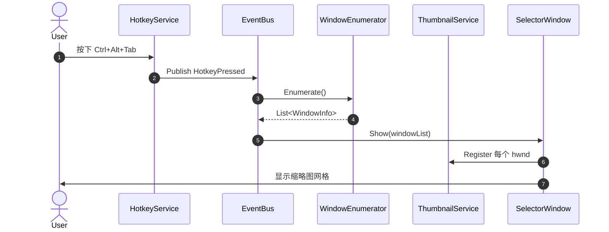
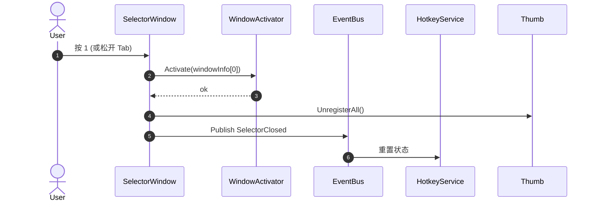
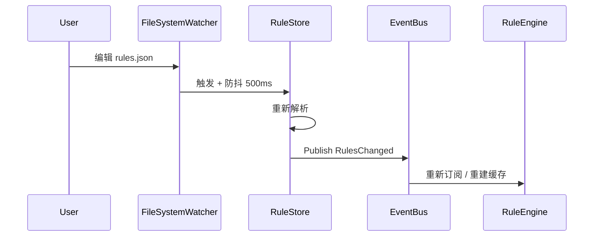

# Alt-Tab 替换器 — 详细设计文档

> 状态：**待评审**
> 版本：v0.1
> 适用阶段：P1 MVP + P2 自定义排序
> 技术栈：C# / .NET 8 / WPF

---

## 1. 目标与范围

### 1.1 一句话目标
替代 Windows 默认 `Alt+Tab` 切换器，提供可自定义的窗口预览 / 选择 / 切换能力，并支持用户自定义窗口排序与排除。

### 1.2 范围内（P1 + P2）
- 全局热键 `Ctrl+Alt+Tab` 唤起选择器
- 当前可见顶层窗口的缩略图网格
- 键盘 `123QWE` 物理位置索引 + 鼠标点击选择
- 窗口激活（最小化恢复 + 置顶 + 切前台）
- 自定义排序规则（置顶 / 排除 / 优先级 / 进程名或窗口标题匹配）
- 简单配置窗口（增删 / 拖拽改优先级 / 启停）
- JSON 持久化 + 热重载

### 1.3 范围外（明确不做）
- 多显示器适配（P3 再说）
- UWP / Store App（Cloaked 窗口）兼容
- 安装包、代码签名、开机自启、托盘
- 多语言、模糊搜索、分组、虚拟桌面

---

## 2. 架构总览

### 2.1 分层

```
┌────────────────────────────────────────────────────┐
│  UI 层 (WPF)                                        │
│  SelectorWindow / ConfigWindow / RuleEditor         │
└────────────────────────┬───────────────────────────┘
                         │ 事件订阅 / 视图模型绑定
┌────────────────────────┴───────────────────────────┐
│  服务层 (Core)                                      │
│  HotkeyService / WindowEnumerator / ThumbnailSvc /  │
│  WindowActivator / RuleEngine / RuleStore / EventBus│
└────────────────────────┬───────────────────────────┘
                         │ P/Invoke
┌────────────────────────┴───────────────────────────┐
│  Win32 互操作层 (user32 / dwmapi / shell32)         │
└────────────────────────────────────────────────────┘
```

### 2.2 进程模型
**单进程**。所有模块同进程内协作，通过 `EventBus` 解耦 UI 与服务。WPF 主线程负责 UI 渲染与消息循环（接收 `WM_HOTKEY`），Win32 调用通过 `Dispatcher.Invoke` 回到 UI 线程执行。

### 2.3 模块通信
- 同步调用：服务 → 服务
- 异步事件：服务 → UI（`IObservable<T>` + `Dispatcher` 投递）
- 状态查询：UI → 仓储（只读快照）

---

## 3. 关键类设计

> 类签名使用 C# 伪代码，仅表达契约，不写实现。

### 3.1 `WindowInfo`（值对象 / record）
```csharp
public sealed record WindowInfo(
    IntPtr Hwnd,
    string Title,
    string ProcessName,
    int ProcessId,
    bool IsMinimized,
    IntPtr IconHandle
);
```

### 3.2 `SortRule`（值对象 / record）
```csharp
public sealed record SortRule(
    Guid Id,
    MatchType MatchType,      // ProcessName | WindowTitle | Regex
    string Pattern,
    int Priority,             // 数值越大越靠前
    bool IsPinned,            // 置顶
    bool IsExcluded           // 排除
);

public enum MatchType { ProcessName, WindowTitle, Regex }
```

### 3.3 `HotkeyService`
```csharp
public interface IHotkeyService
{
    event Action HotkeyPressed;
    event Action HotkeyReleased;

    bool Register(ModifierKeys mods, Key key);  // false 表示已被占用
    void Unregister();
}
```
- 内部用 `HwndSource` 接收 `WM_HOTKEY`
- 注册 ID 固定为 `0xBEEF`，避免冲突
- 修饰键按下 / 释放通过 `GetAsyncKeyState` 轮询（30Hz）感知

### 3.4 `WindowEnumerator`
```csharp
public interface IWindowEnumerator
{
    IReadOnlyList<WindowInfo> Enumerate();  // 同步，按"用户期望顺序"输出
}
```
- 调用 `EnumWindows` 收集
- 应用过滤（详见 5.2）
- 调用 `RuleEngine.Apply` 重排
- **P1 阶段**：`RuleEngine` 是 no-op（按 z-order 倒序输出）

### 3.5 `ThumbnailService`
```csharp
public interface IThumbnailService
{
    IntPtr Register(IntPtr sourceHwnd, IntPtr destinationHwnd);
    void Update(IntPtr thumbnail, RECT dest, bool visible = true);
    void Unregister(IntPtr thumbnail);
}
```
- 包装 DWM API
- 缓存 HTHUMB → source HWND 映射，便于失效清理

### 3.6 `WindowActivator`
```csharp
public interface IWindowActivator
{
    void Activate(WindowInfo target);
}
```
- 实现见 5.4

### 3.7 `RuleEngine`
```csharp
public interface IRuleEngine
{
    IReadOnlyList<WindowInfo> Apply(IReadOnlyList<WindowInfo> raw);
}
```
- 流程：排除 → 置顶 → 按 Priority 降序 → 同优先级按 z-order 倒序
- `RuleStore` 变化时通过 `EventBus` 通知 `WindowEnumerator` 重建

### 3.8 `RuleStore`
```csharp
public interface IRuleStore
{
    IReadOnlyList<SortRule> Current { get; }
    void Add(SortRule rule);
    void Remove(Guid id);
    void Update(SortRule rule);

    event Action Changed;  // 防抖 500ms 后触发
}
```
- 内部：JSON 文件 + `FileSystemWatcher`（兼容外部编辑）

### 3.9 `EventBus`
```csharp
public interface IEventBus
{
    void Publish<T>(T evt);
    IDisposable Subscribe<T>(Action<T> handler);
}
```
- 极简实现：类型 → 委托字典
- UI 端订阅时通过扩展方法 `OnUIThread()` 自动 `Dispatcher.Invoke`

### 3.10 `SelectorWindow`（WPF 视图）
- `ItemsControl` 绑定 `IReadOnlyList<WindowInfo>`
- 模板：缩略图 + 标题 + 索引标签
- `PreviewKeyDown` 处理 123QWE
- `MouseMove` 改变 `SelectedIndex`
- `MouseLeftButtonUp` 确认

---

## 4. 数据流 / 时序

### 4.1 唤起选择器


### 4.2 切换窗口


### 4.3 进程死亡 / 窗口关闭
- `WindowEnumerator` 每次 `Enumerate` 重新走 `EnumWindows`，无显式订阅
- 选择器显示期间，UI 端轮询（1Hz）刷新 `IsWindow` 与可见性，关闭的窗口从网格移除

### 4.4 规则热重载


---

## 5. 关键技术细节

### 5.1 全局热键
- 默认热键是 `Alt+Tab`，目标是**替换系统自带的任务切换器**
- `Alt+Tab`（以及 `Alt+Esc`）是系统保留组合，**`RegisterHotKey` 注册不到**，即使返回成功也收不到 `WM_HOTKEY`。
  因此走 `WH_KEYBOARD_LL` 低层键盘钩子：`Tab` 在 `Alt` 按下时以 `WM_SYSKEYDOWN` 到达钩子，
  回调里返回 `1` 把它吞掉，系统任务切换器收不到按键就不会弹出
- 其它组合（用户在 `settings.json` 里自定义的）仍走 `RegisterHotKey(hwnd, id, mods | MOD_NOREPEAT, vk)` + 窗口子类化拦 `WM_HOTKEY`
- 钩子路径下没有 `WM_HOTKEY` 附带的"设前台"许可，需要 `AttachThreadInput` 挂到当前前台线程后再 `SetForegroundWindow`，否则会被前台锁拒绝
- 钩子回调必须快速返回（超过 `LowLevelHooksTimeout`，默认 300ms，系统会静默摘钩），只做判断 + `Dispatcher.BeginInvoke` 投递
- 限制：低层钩子对 UAC 提权窗口与安全桌面无效，除非本程序也以管理员身份运行
- 选择器可见期间的导航键（`Tab` / `Shift+Tab` / `↑` / `↓` / `Enter` / `Esc` / `PageUp` / `PageDown`）统一在
  `SelectorWindow` 的**窗口级 `PreviewKeyDown`** 里处理：焦点在搜索框上，`Tab` 会先被 WPF 焦点导航吃掉，
  冒泡的 `KeyDown` 收不到，必须在隧道阶段截
- **`Alt` 还按着时必须读 `e.SystemKey`**：WPF 会把 Alt 组合键报成 `e.Key == Key.System`，真正的键在 `SystemKey` 里。
  只看 `e.Key` 的话方向键会全部漏过去，最终被 `DefWindowProc` 拿去激活窗口菜单（移动/大小/关闭），
  焦点被抢走后导航就彻底失效。另外还要吞掉 `WM_SYSCOMMAND` 的 `SC_KEYMENU`，堵住其余 Alt 组合触发菜单的路径
- 选择器已打开时再次按热键 = **关闭**，与 `Esc` 同义（toggle）。
  代价是"按住 `Alt` 连点 `Tab` 往下走"的经典手感没有了：`Alt` 还按着时 `Tab` 就是 `Alt+Tab`，
  必然走热键路径。要用 `Tab` 导航得先松开 `Alt`
- **抢前台只能在"确定要开"之后做，且只能作用在选择器自己身上。**
  踩过的坑：`HotkeyService` 在通知订阅方之前先把 `HostWindow` 顶到前台，
  这会让已打开的选择器失焦 → 触发"失焦即关闭" → 等 `HotkeyPressed` 真正执行时
  它看到的已经是"没开" → 于是又新开一个。一次按键变成**先关后开**，toggle 永远关不掉。
  另外 `HostWindow` 是 `Visibility=Hidden` 的 0×0 窗口，把它设前台还得先 `SW_SHOW` 一个本该隐藏的窗口。
  正确做法：热键回调只负责通知；抢前台放在 `Show()` 之后直接作用在选择器上
  （`AttachThreadInput` 本来就不依赖本进程当前是不是前台）
- 修饰键释放**不**关闭选择器（Quick-Switcher 模式）：只有点击 / 按索引键 / `Enter` / `Esc` / 再次按热键才关闭
- 选择器**失焦即关闭**（`Window.Deactivated`）：导航键走 WPF 键盘路径，没有焦点就全是死的，
  留一个不响应的浮窗挡在屏幕上比直接关掉更糟。所有关闭路径统一收敛到带 `_closing` 重入保护的出口——
  切到目标窗口本身就会触发 `Deactivated`，不加保护会重入 `Close()`

### 5.1.1 钩子优先级与自愈

"热键有时候突然不灵"有四个独立成因，对应四条措施：

| 成因 | 表现 | 措施 |
|---|---|---|
| **抬键闩锁卡死** | 用户先松 `Alt` 再松 `Tab` 时，`Tab` 的 keyup 里 `Alt` 已经是 false。若先判修饰键再处理抬键，`_hookKeyHeld` 会永远停在 true，**下一次热键被当成"自动重复"静默吞掉**，表现为隔一次失灵一次 | `TryHandleHookKey` 里**无条件先处理抬键**；未被吞掉的按下也顺手清闩锁 |
| **UI 线程饿死钩子** | LL 钩子回调是"投递消息到装钩子的线程"执行的。挂在 WPF UI 线程上时，打开选择器要对 20+ 窗口逐个 `PrintWindow`，轻松几百毫秒，期间回调派发不出去，超过 `LowLevelHooksTimeout`（默认 300ms）系统直接跳过甚至摘钩 | 钩子改到**专用线程**上，线程里自跑 `GetMessage` 循环，常年空转不受 UI 影响 |
| 钩子链顺序 | 后启动的程序也挂了键盘钩子，排在我们前面把 `Alt+Tab` 吞了 | 定时**重挂**钩子回到链头（链是"后装的先调用"），通过 `PostThreadMessage` 让钩子线程自己重挂 |
| UIPI / 完整性级别 | 提权窗口（任务管理器等）在前台时，非提权进程的钩子**根本收不到**按键 | 以管理员身份运行（`app.manifest` 的 `requestedExecutionLevel`） |

重挂有个极短空窗期，这期间的 `Alt+Tab` 会漏给系统，所以按着修饰键时跳过该轮。

> **钩子回调里绝对不能写日志。** `Logger` 是同步文件 IO（每次 `AppendAllText` 开关文件一次），
> 放进回调就是往 300ms 预算里塞不可控的磁盘延迟。需要记录的一律 `Dispatcher.BeginInvoke` 到 UI 线程再写。

**可观测性**：失败的触发原本在日志里**不留任何痕迹**，三种失败（钩子掉了 / 被闩锁吞了 / 弹出后瞬间失焦自关）
长得一模一样，没法排查。现在补了：热键触发、钩子丢失/恢复、选择器失焦自动关闭、选择器打开耗时（>300ms 报 WARN）。


### 5.2 窗口枚举与过滤
**调用**：`EnumWindows(EnumWindowsProc, IntPtr.Zero)`

**过滤条件（全部满足才保留）**：
| # | 条件 | API |
|---|---|---|
| 1 | 可见 | `IsWindowVisible(hwnd) == true` |
| 2 | 非工具窗口 | `(GetWindowLong(hwnd, GWL_EXSTYLE) & WS_EX_TOOLWINDOW) == 0` |
| 3 | 非 Cloaked | `DwmGetWindowAttribute(DWMWA_CLOAKED) == 0`（UWP 后台） |
| 4 | 非自身 | `hwnd != process.MainWindowHandle && hwnd != thisHwnd` |
| 5 | 标题非空 | `GetWindowTextLength > 0` |
| 6 | 有 PID | `GetWindowThreadProcessId != 0` |
| 7 | 进程可访问 | `OpenProcess(QueryLimitedInformation) != 0`（排除系统保护进程） |

**排序（未应用规则时）**：按 z-order 倒序（最近激活的在前）。`EnumWindows` 本身是 z-order，逆序遍历即可。

**性能**：典型 10–30 个窗口，<5ms。

### 5.3 缩略图（DWM）
- `DwmRegisterThumbnail(thisHwnd, sourceHwnd)` → HTHUMB
- `DwmUpdateThumbnailProperties`：
  - `DWM_TNP_RECTDESTINATION`：256×144（或等比缩放）
  - `DWM_TNP_VISIBLE` = true
  - `DWM_TNP_OPACITY` = 255
  - `DWM_TNP_SOURCECLIENTAREAONLY` = false（含边框）
- 关闭 / 隐藏选择器时遍历 `DwmUnregisterThumbnail`
- **坑点**：必须在 WPF 窗口已经 `Show()` 之后才能注册缩略图（HTHUMB 绑到目标 HWND 句柄）

### 5.4 窗口激活
Windows 限制：只有前台进程能把窗口设为前台。

**P1 解决方案（足够稳）**：
1. `AllowSetForegroundWindow(targetPid)` —— 在切窗前调用
2. 若最小化：`ShowWindow(hwnd, SW_RESTORE)`
3. `BringWindowToTop(hwnd)`
4. `SetForegroundWindow(hwnd)`

**兜底**：若步骤 4 失败，模拟一次 `Alt` 按键（`keybd_event` 或 `SendInput`）解锁前台锁，再重试一次。

**重试**：最多 3 次，每次间隔 50ms。

### 5.5 键盘索引映射：16 键 4×4
按 QWERTY **物理位置** 取左手主键区一个完整方块，物理位置和界面网格一一对应：

| 行 | Virtual Key | 索引 |
|---|---|---|
| 数字 | `VK_1` `VK_2` `VK_3` `VK_4` | 0–3 |
| Q 行 | `VK_Q` `VK_W` `VK_E` `VK_R` | 4–7 |
| A 行 | `VK_A` `VK_S` `VK_D` `VK_F` | 8–11 |
| Z 行 | `VK_Z` `VK_X` `VK_C` `VK_V` | 12–15 |

共 16 个键位。**两级结构**下容量是 16 × 16 = 256 个窗口，不再需要翻页。
槽位超过 16 个时第 16 格自动变成「更多…」组装下余量（见 5.6）。

> 缩到 16 键的副作用：`5-9 0 T Y U I O P G H J K L B N M` 不再被钩子吞掉。
> 但索引键仍会抢走输入，所以搜索改成显式模式（`/` 进入、`Esc` 退出），
> 进入搜索时通过 `SearchModeChanged` 通知 App 让钩子整体放行索引键。

### 5.6 槽位布局：分组与排序

顺序和分组由 `layout.json` 表达，**不再**编码进 `SortRule.Priority`。
旧方案的坑：一个进程开多个窗口会写出多条同 Pattern、不同 Priority 的规则，
而"取命中规则的最大值"会把该进程的每个窗口都抬到它占过的最高位置，顺序看起来就像没被记住。

| 组件 | 职责 |
|---|---|
| `LayoutStore` | `layout.json` 读写 + 防抖热重载（自写入 1.5s 内不回灌） |
| `LayoutResolver` | 枚举结果 + 布局 → 实际的 16 槽位树。纯函数 |
| `SlotEditor` | 排序 / 并组 / 移出组。纯函数 |
| `RuleEngine` | **退化为只管排除**，不再排序 |

解析规则依次施加：
1. 按 `layout.json` 的顺序安置已知进程的窗口
2. 布局里没提到的进程按 z-order 追加在后面
3. 同进程窗口数 ≥ `AutoGroupThreshold`（默认 2）自动折叠成组
4. 组内成员按 z-order 排，**不做持久化**
5. 只剩 1 个成员的组自动降级为窗口槽位
6. 槽位超过 16 个时第 16 格变成「更多…」溢出组（`ToDocument` 时会被摊平，不固化）

#### 窗口标识
**身份只锚定在 `ProcessName` 上**，因为它是唯一跨会话稳定的线索：
HWND 重启即变，窗口标题会随着换文件 / 换标签而变。窗口级的易变性全部交给运行时 z-order 吸收。
代价：自动折叠出来的单进程组没法把"其中某一个窗口"单独拖出来，`SlotEditor.MoveOutOfGroup` 返回 `null`。

#### 拖放语义（落点分区）
每行垂直切三段，**落点位置决定语义**，不需要修饰键：

| 落点 | 语义 | 反馈 |
|---|---|---|
| 上 25% | 插到本行之前 | 2px 插入线（两端带圆点） |
| 中 50% | 并入本行成组 | 整行 2px 圆角描边 + 背景提亮 |
| 下 25% | 插到本行之后 | 2px 插入线 |
| 二级拖到面包屑 | 移出该组 | 面包屑高亮描边 |

`Shift` 强制排序、`Ctrl` 强制分组，作为逃生通道。
插入线放在 `IsHitTestVisible=False` 的 `Canvas` 上，避免干扰拖动命中测试。

> ⚠️ **踩过的坑（导致拖动时闪退）**：`PART_DropLayer` 和 `PART_List` 是**兄弟**节点，
> 而 `Visual.TransformToAncestor` 要求目标必须是**祖先**，否则抛 `InvalidOperationException`。
> 拖动时每帧都会算插入线位置，所以一进到行的上/下 25% 区域就必崩
> （中间 50% 走的是"并入"分支，不碰这个调用——这也是它看起来时灵时不灵的原因）。
> 正确做法是转到二者的共同父级 `PART_ListHost`。
> 另外全局补了 `DispatcherUnhandledException` 与钩子回调的 try/catch：
> 常驻托盘程序最糟的失败方式是"悄悄消失"，UI 异常现在会记日志并继续运行。

#### 重命名
右键行 → 重命名。名字存在 `SlotDefinition.Name`，**只有用户改过的才落盘**——
没改过的名字不存，因为窗口标题会变，存了反而会过期。
清空输入框即恢复默认名（`ResolvedSlot.WithName(null)`）。
`ResolvedSlot.CustomName` 与 `Name` 分开：`Name` 是显示用的，`CustomName` 是"用户改过"的标记。
并组 / 排序 / 移出组都会带着 `CustomName` 走。

### 5.7 图标提取

原来只用 `WM_GETICON`，但很多程序根本不响应（UWP、部分 Electron/Java 程序、自绘标题栏的应用），
那些窗口就显示不出图标。`IconExtractor` 改成四级兜底：

| 级别 | 手段 | 适用 |
|---|---|---|
| 1 | `WM_GETICON`（BIG → SMALL → SMALL2） | 应用自己声明的，质量最好 |
| 2 | `GetClassLongPtr(GCLP_HICON / GCLP_HICONSM)` | 注册窗口类时挂的图标 |
| 3 | `ExtractIconEx` 扒 exe 图标资源 | 对不响应消息的程序最有效 |
| 4 | `SHGetFileInfo` | 走 shell 解析，连无图标资源的程序也能拿到默认图标 |

**句柄所有权**：第 1、2 级借来的是别人的（不能销毁），第 3、4 级是新建的（必须销毁）。
为了不把这套规则泄漏给调用方，`GetWindowIcon` 一律 `CopyIcon` 复制后再返回，
调用方只需 `IconExtractor.Release(hIcon)` 配对释放。

实测：本机 32 个可见窗口全部取到图标，包括 `ApplicationFrameHost.exe`（UWP 宿主）
和 `SystemSettings.exe` 这类典型的 `WM_GETICON` 失败案例。

### 5.7 持久化
- 文件路径：`%APPDATA%\AltTabReplacer\rules.json`
- 格式：
  ```json
  [
    {
      "id": "uuid",
      "matchType": "ProcessName",
      "pattern": "Code.exe",
      "priority": 100,
      "isPinned": true,
      "isExcluded": false
    }
  ]
  ```
- 写入策略：变更后 500ms 防抖
- 加载：启动 + `FileSystemWatcher`（外部编辑后自动重载）
- 损坏备份：解析失败 → 备份为 `rules.json.bak.YYYYMMDD-HHmmss` + 用默认空规则

---

## 6. UI 设计

### 6.1 选择器窗口
| 属性 | 值 |
|---|---|
| 尺寸 | 主显示器工作区 × `Layout.WidthRatio` / `HeightRatio`（默认 0.5 / 0.55），下限 640×420 DIP |
| 位置 | 主显示器正中 |
| 背景 | `#202020` + Alpha 204（约 80% 不透明） |
| 圆角 | 8px |
| 阴影 | DWM DropShadow |
| 置顶 | `Topmost = true` |
| 任务栏图标 | `ShowInTaskbar = false` |
| 启动位置 | `WindowStartupLocation = Manual`，几何在 `SourceInitialized` / `Loaded` 里算 |

尺寸不用 `CenterScreen` 也不写死像素，原因：

- `CenterScreen` 在多显示器下居中到的不一定是**主**显示器
- `Screen.WorkingArea` 是**物理像素**，而 WPF 的 `Left/Top/Width/Height` 是 **DIP**，
  高 DPI 缩放下两者不等，必须用 `CompositionTarget.TransformFromDevice` 换算；
  换算尺寸时用 `Vector` 而不是 `Point`，避免被矩阵的平移分量影响
- `Loaded` 里会再算一次：`SourceInitialized` 时窗口还没挪到主显示器，
  混合 DPI 下那一刻拿到的缩放可能属于别的屏
- 左右分栏也改成按比例（`0.36*` / `0.64*`，左栏 `MinWidth=280`），否则窗口变大时侧栏会显得很窄

### 6.2 单元格模板
```
┌──────────────┐
│ 1         256×144 缩略图 │
│              │
│              │
├──────────────┤
│ 窗口标题（截断 32 字符）    │
└──────────────┘
```
- 选中态：外框 2px 主题色，缩略图缩放 1.05x
- 索引标签：缩略图左上角，半透明圆角矩形，文字 12px

### 6.3 交互
| 输入 | 行为 |
|---|---|
| `123QWE…` 物理键 | 切换高亮（命中翻页则跳页） |
| 鼠标移动 | 切换高亮 |
| 鼠标左键点击 | 切到该窗口 + 隐藏选择器 |
| `Esc` / `Backspace` | 逐级回退：二级 → 一级 → 关闭 |

| `Shift+Tab` / `↑` | 选中上一项 |
| 再按 `Alt+Tab` | 关闭选择器（与 `Esc` 相同） |
| 选择器外点击 | 取消 + 隐藏 |

---

## 7. 配置项

| 键 | 默认值 | 说明 |
|---|---|---|
| `Hotkey.Modifiers` | `Ctrl, Alt` | 修饰键组合 |
| `Hotkey.Key` | `Tab` | 触发键 |
| `Layout.CellWidth` | `256` | 缩略图宽度（px） |
| `Layout.CellHeight` | `144` | 缩略图高度（px） |
| `Layout.CellPadding` | `8` | 单元格间距（px） |
| `Layout.MaxColumns` | `4` | 4×4 网格的列数 |
| `Layout.AutoGroupThreshold` | `2` | 同进程几个窗口起自动折叠成组（99=关闭） |
| `Theme.Accent` | `#FF0078D4` | 主题色 |
| `Theme.Background` | `#CC202020` | 背景色 |
| `Theme.CornerRadius` | `8` | 圆角（px） |
| `Behavior.HideOnWindowChange` | `true` | 切窗后自动隐藏 |
| `Behavior.IgnoreFullscreen` | `true` | 忽略全屏独占（避免被游戏顶掉） |
| `Behavior.PollIntervalMs` | `1000` | 进程死亡轮询间隔 |
| `Logging.Level` | `Information` | Serilog 最低级别 |
| `Logging.Path` | `%APPDATA%\AltTabReplacer\logs\app-.log` | 日志文件 |

**配置文件位置**：`%APPDATA%\AltTabReplacer\settings.json`

---

## 8. 错误处理

| 失败 | 处理 |
|---|---|
| 热键已被占用 | MessageBox 提示 + 不启动选择器 + 写日志 |
| 缩略图注册失败 | 用纯色占位 + 标题文字 |
| 窗口激活失败 | 重试 3 次（间隔 50ms），仍失败则写日志 + 不隐藏选择器 |
| 规则 JSON 损坏 | 备份原文件 + 用空规则 + 提示 |
| 配置文件 JSON 损坏 | 备份 + 用默认值 |
| 进程死亡 | 选择器显示期间轮询 1Hz 刷新窗口列表 |

**日志**：Serilog → 滚动日志，每天一个文件，保留 7 天。

---

## 9. 待评审决策点

> 这些点影响最终体验与实现量，请挑有意见的回答，没意见就回"全部默认"。

- **D-01** 热键默认值
  - 候选：`Ctrl+Alt+Tab`（推荐，不与系统冲突） / `CapsLock`（更顺手但有副作用） / `Alt+Tab`（需要 hook，复杂且易触发反病毒告警）
- **D-02** 切换模式
  - 候选 A：**按住不松手，松开就切**（与系统 Alt+Tab 一致，推荐）
  - 候选 B：按一次显示，再按一次确认（不会误切）
- **D-03** 规则匹配维度
  - 候选 A：只匹配 `ProcessName`（简单，80% 场景够用）
  - 候选 B：ProcessName + WindowTitle + Regex 三种（推荐 P2 一次性做完）
- **D-04** ~~超出 35 个键位的处理~~ → **已定**：键位缩到 16（4×4），超出部分由第 16 格的
  「更多…」溢出组承载，不再分页。见 5.5 / 5.6
- **D-05** ~~P1 是否需要方向键 + Enter 全键盘导航~~ → **已定**：需要。
  `↑↓` / `Tab` / `Shift+Tab` 移动，`Enter` 确认，`Esc` / `Backspace` 逐级回退
- **D-06** 配置文件位置
  - 候选 A：`%APPDATA%\AltTabReplacer\`（推荐，标准）
  - 候选 B：项目目录下的 `.config/`（更便携）
- **D-07** 项目命名空间 / 程序集名
  - 默认：`AltTabReplacer`（与目录名一致）

---

## 10. 目录结构

```
AltTabReplacer/
├── AltTabReplacer.sln
├── src/
│   ├── AltTabReplacer.App/              # WPF 启动器 + 视图
│   │   ├── App.xaml(.cs)
│   │   ├── Views/
│   │   │   ├── SelectorWindow.xaml(.cs)
│   │   │   ├── ConfigWindow.xaml(.cs)
│   │   │   └── RuleEditor.xaml(.cs)
│   │   ├── ViewModels/
│   │   │   ├── SelectorViewModel.cs
│   │   │   └── ConfigViewModel.cs
│   │   └── AltTabReplacer.App.csproj
│   └── AltTabReplacer.Core/             # 服务 + 模型 + Win32
│       ├── Services/
│       │   ├── HotkeyService.cs
│       │   ├── WindowEnumerator.cs
│       │   ├── ThumbnailService.cs
│       │   ├── WindowActivator.cs
│       │   ├── RuleEngine.cs
│       │   └── RuleStore.cs
│       ├── Models/
│       │   ├── WindowInfo.cs
│       │   ├── SortRule.cs
│       │   ├── MatchType.cs
│       │   └── Settings.cs
│       ├── Infrastructure/
│       │   ├── EventBus.cs
│       │   ├── Logger.cs
│       │   └── Win32/
│       │       ├── NativeMethods.cs    # P/Invoke 集中
│       │       └── Structures.cs       # RECT / DWM_THUMBNAIL_PROPERTIES 等
│       └── AltTabReplacer.Core.csproj
├── docs/
│   ├── design.md                        # 本文档
│   └── roadmap.md
├── samples/
│   └── rules.example.json
└── README.md
```

---

## 11. 关键 P/Invoke 清单

| API | 库 | 用途 |
|---|---|---|
| `RegisterHotKey` / `UnregisterHotKey` | user32 | 全局热键（非系统保留组合） |
| `SetWindowsHookEx(WH_KEYBOARD_LL)` / `UnhookWindowsHookEx` | user32 | 接管 Alt+Tab、绕开 IME |
| `EnumWindows` / `EnumWindowsProc` | user32 | 窗口枚举 |
| `GetWindowText` / `GetWindowTextLength` | user32 | 标题 |
| `GetWindowThreadProcessId` | user32 | PID |
| `IsWindowVisible` | user32 | 可见性 |
| `GetWindowLong` | user32 | 扩展样式 |
| `DwmGetWindowAttribute` | dwmapi | Cloaked 标志 |
| `DwmRegisterThumbnail` / `DwmUnregisterThumbnail` | dwmapi | 缩略图 |
| `DwmUpdateThumbnailProperties` | dwmapi | 缩略图属性 |
| `SetForegroundWindow` / `BringWindowToTop` | user32 | 切窗 |
| `ShowWindow` | user32 | 最小化恢复 |
| `AllowSetForegroundWindow` | user32 | 解锁前台限制 |
| `AttachThreadInput` | user32 | 钩子路径下绕开前台锁 |
| `GetWindowPlacement` | user32 | 最小化状态 |
| `OpenProcess` / `CloseHandle` | kernel32 | 进程信息 |
| `QueryFullProcessImageName` | kernel32 | 进程路径 |

---

## 12. 里程碑验收标准

### P1 MVP 验收
- [ ] 按下 `Ctrl+Alt+Tab` 弹出选择器，松开任一修饰键切到高亮窗口
- [ ] 缩略图正确显示至少 5 个常见应用（Chrome / VSCode / Explorer / Notepad / 系统设置）
- [ ] 键盘 `123QWE` 切换高亮正确
- [ ] 鼠标点击切换正确
- [ ] 选择器能正确处理窗口关闭（被关闭的窗口从网格消失）
- [ ] 最小化窗口能被恢复并切到前台
- [ ] 进程退出后选择器不残留

### P2 自定义排序验收
- [ ] 配置窗口能增删规则
- [ ] 拖拽 / 上下按钮调整 Priority
- [ ] 置顶 / 排除开关实时生效
- [ ] `rules.json` 被外部编辑后自动重载
- [ ] 损坏文件不导致崩溃（备份 + 默认值）

---

> 评审完成后，回复"全部默认"或具体决策点编号（D-01 ~ D-07）即可进入编码。
